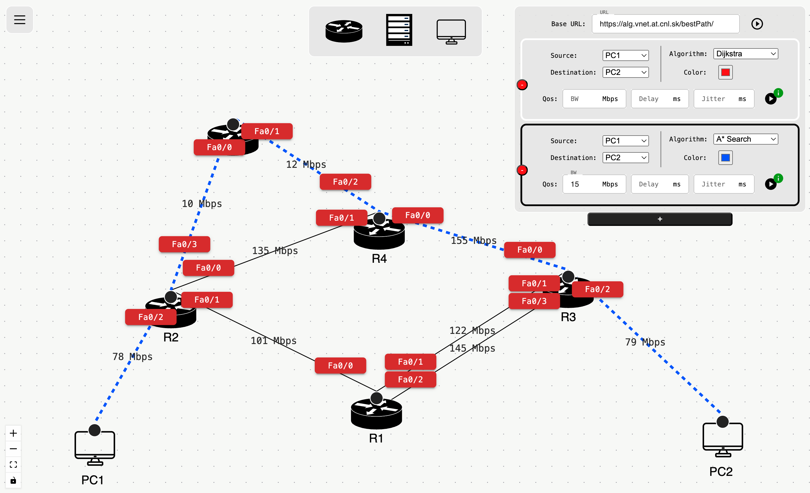

#  Netvis - Network Topology Visualisation Tool

Netvis is a browser-based network topology editor and algorithm visualizer.
Build a graph with drag-and-drop devices, configure wired/Wi‑Fi links (interfaces, IPs, bandwidth), then send the topology to an external algorithm service to compute paths and view results as highlighted paths on the canvas and stats in the controller.

Live demo: https://netvis2.netlify.app/

## Backend (algorithm service)

Netvis calls an external algorithm service to compute best paths based on the current topology. 

- Backend project: <https://github.com/ivanbrtka/netvis_backend>
- You’re also free to build and run your own backend service, as long as it implements the same HTTP endpoints and request/response contract.

Setup details (API base URL, payload format): see [DEVELOPMENT.md](DEVELOPMENT.md).

## Features

### Topology editor
- Drag devices from the toolbar onto the canvas.
- Connect devices by drawing links.
- Duplicate links are supported (up to 3 parallel edges between the same nodes).
- Edges have an interactive menu (router + wireless router links):
    - wired links: interface selection (FastEthernet/Gigabit/Serial)
    - WiFi links (wireless router ↔ PC): fixed “WiFi” interface + band (2.4/5 GHz), rendered as a dashed link
    - per-interface IP address + subnet mask
    - bandwidth and link enable/disable

### Controllers + algorithms
- A Control Bar lets you add up to 4 controllers.
- Each controller selects source + destination nodes and an algorithm, then posts the current graph to the algorithm service.
- Supported algorithms (HTTP endpoints): DFS, BFS, Dijkstra, Bellman Ford, ANT, A* Search, Floyd Warshall, Yen.
- Controller results:
    - highlight returned paths on the canvas
    - show basic stats (time, visited states, memory)

### Additional features
- Theme toggle (light/dark) via menu or shortcut.
- Save the current flow via menu or shortcut.
- Upload a saved flow.
- Select multiple nodes/edges by pressing `Shift` and dragging a selection box.
- Upon selecting a node/edge/selection, press `Delete` to remove it.

Keyboard shortcuts:
- Save flow: macOS `⌘S` / other `Ctrl+S`
- Upload flow: macOS `⌘U` / other `Ctrl+U`
- Toggle theme: macOS `⌘K` / other `Ctrl+K`

## Quickstart (development)

```bash
npm install
```
```bash
npm start
```

Then open http://localhost:3000

## Build & run with Docker

### Build locally
```bash
docker build -t netvis .
docker run --rm -p 8080:80 netvis
```

Then open http://localhost:8080

### docker-compose
`docker-compose.yml` runs a prebuilt image and exposes it on port 80:

```bash
docker compose up
```

Then open http://localhost:8080

## Documentation

- Developer docs (setup, API base URL, payload, examples): see [DEVELOPMENT.md](DEVELOPMENT.md)

## License
This project is licensed under the Apache License 2.0 – see the [LICENSE](LICENSE) file for details.
